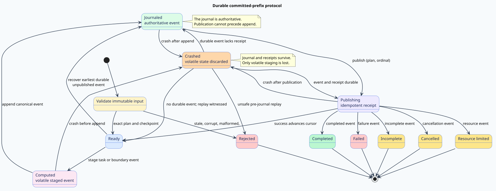

# Durable resume protocol design

## Scope

The protocol extends schedlib's immutable plan and ordered commit semantics.
It does not make schedlib a filesystem, database, process supervisor, or
distributed consensus system. schedlib owns semantic validation and the
iterative recovery machine. `schedlib-interop` will own canonical portable
bytes and domain-separated digests. `vinary-runtime` continues to own durable
artifact creation, replacement, synchronization, retention, and recovery.

The accepted boundary is illustrated in the
[responsibility diagram](figures/durable-resume-boundaries.svg). This dependency
direction keeps JSON, hashing, filesystem APIs, runtime artifacts, and storage
failure policy out of the scheduling hot loop.

## State machine



[PlantUML source for the durable state machine](figures/durable-resume-state-machine.puml)

| Phase | Durable state | Volatile state | Enabled semantic action |
| --- | --- | --- | --- |
| Validate | Input checkpoint | Validation cursor | Accept exact input or reject without new effects |
| Ready | Journal and receipts | Next task cursor | Drain a missing receipt or stage the next canonical event |
| Computed | Unchanged | Staged event and task result | Append, crash, or reject unsafe recovery |
| Journaled | Appended event | Staged event | Publish its plan-and-ordinal identifier |
| Publishing | Event and receipt | Cursor transition | Advance after success or enter the exact terminal phase |
| Crashed | Journal and receipts preserved | Staging discarded | Fail closed, republish, advance, or replay under witness |
| Terminal | Final event and receipt | None | Return immutable report |

`Rejected` is terminal but is not a durable task outcome. It describes invalid
input or unsafe recovery. `Failed`, `Incomplete`, `Cancelled`,
`ResourceLimited`, and `Completed` are distinct typed terminal observations.

## Literate recovery algorithm

The algorithm first validates immutable input. It then gives prior durable
events publication priority over all new task work. This order is the liveness
counterpart of journal-first safety: a durable event cannot remain invisible
while later work advances.

> **Committed-prefix recovery.** Treat the journal as authority. At each loop
> iteration, publish the earliest durable event without a receipt. Otherwise,
> reconstruct the task cursor from the successful event prefix. Return a
> terminal journal immediately. Only then stage the next task or terminal
> boundary. Append before publishing. A crash discards only volatile staging.

```text
RESUME(active-plan, checkpoint, policy, limits)
    IF NOT VALIDATE(active-plan, checkpoint, limits)
        RETURN REJECTED

    journal := checkpoint.journal
    receipts := checkpoint.receipts

    LOOP
        missing := EARLIEST-UNPUBLISHED(journal, receipts)
        IF missing EXISTS
            receipts := INSERT-ONCE(receipts, ID(missing))
            CONTINUE

        cursor := SUCCESS-PREFIX-LENGTH(journal)
        IF journal ENDS WITH terminal-event
            RETURN TERMINAL-REPORT(journal, receipts)

        staged := COMPUTE-CANONICAL-EVENT(cursor, policy)
        IF CRASH OCCURS BEFORE APPEND
            IF staged IS task-event AND NOT REPLAY-WITNESSED(staged.task)
                RETURN REJECTED-UNSAFE-REPLAY
            CONTINUE

        journal := APPEND-CHECKED(journal, staged)
        receipts := INSERT-ONCE(receipts, ID(staged))
```

The loop, journal, receipt sequence, and cursor are heap resident. No transition
recurses. Checked arithmetic precedes capacity reservation or byte allocation.

## Structural identity design

The structural manifest is the source of truth. A future interop digest has
three requirements:

1. canonical, versioned, domain-separated input bytes;
2. equality confirmation against the complete structural manifest after a
   digest hit; and
3. no collision-driven merge, checkpoint acceptance, or task suppression.

Changing a dependency, effect, cost, budget, key, semantic profile, or schema
creates a different identity. Insertion order does not, because every
collection is canonicalized before identity construction.

## Publication contract

`PublicationLedger` is conceptually an ordered set, not a multiset. Its public
order is the journal order. Hash tables may accelerate exact membership, but
unordered iteration cannot escape into serialization or reports. A receipt is
accepted only when the referenced event is already in the journal and all
earlier events are already published.

## Error precedence

Validation is complete before effects. Within one boundary, stale plan,
malformed key map, corrupt journal, malformed cursor/count, foreign receipt,
and limit violations all reject before task execution. During valid execution,
cancellation wins a simultaneous cancellation/resource boundary. Task failure
and incomplete outcomes occur only after the corresponding task event has been
appended and published.

## Complexity contract

For $`n`$ keys, $`m`$ dependency edges, $`j`$ journal events, and $`b`$
encoded bytes, validation and replay target $`O(n+m+j+b)`$ work and
$`O(n+j+b)`$ owned heap. Receipt membership may use exact-key indexing, but
canonical publication walks each journal event at most once. Prefix rescanning
per event and cloning the journal per transition are forbidden because both
produce quadratic behavior.

## Non-goals

- No transparent replay of arbitrary side effects.
- No claim that logical exactly-once publication implies one physical call.
- No runtime-owned artifact or filesystem type in schedlib.
- No cryptographic collision assumption in the core proof.
- No reassociation of bounded or incomplete pipeline observations.
- No native recursion proportional to plan or journal depth.
