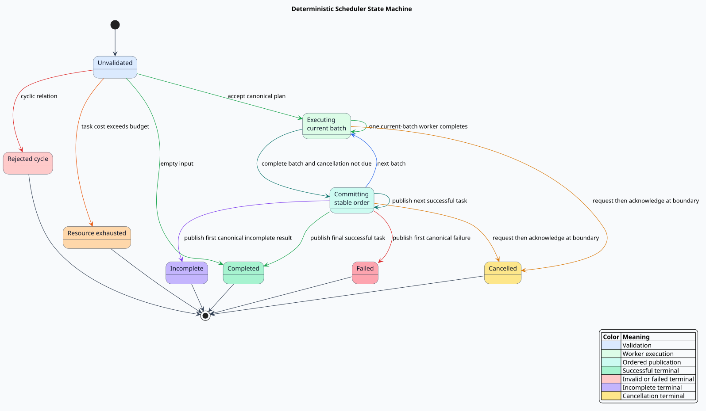
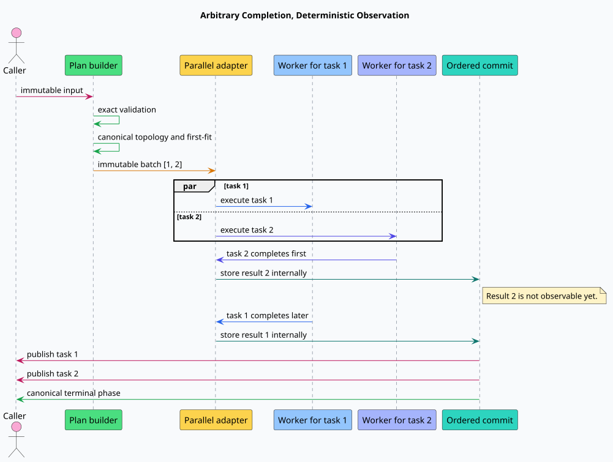

# Formal state machine

## State overview

The machine begins in `Unvalidated` and reaches exactly one terminal phase.
Validation precedes every worker result. Accepted plans alternate between
`Executing` and `Committing` until success, failure, incomplete execution, or
cancellation. An empty input moves directly from `Unvalidated` to `Completed`.

[PlantUML source for the scheduler state machine](figures/scheduler-state-machine.puml)

## Variables

Input variables never change: dependencies, read sets, write sets, costs,
outcomes, and cancellation count. Execution variables are phase, immutable
plan, current batch index, completed-result set, current commit index, committed
prefix, and cancellation-request flag.

## Transitions

| Transition | Preconditions | Atomic effect |
| --- | --- | --- |
| `RejectCycle` | Unvalidated and cyclic dependency relation | Enter rejected-cycle without publishing work |
| `RejectResources` | Unvalidated, acyclic, and some task exceeds budget | Enter exhausted without publishing work |
| `AcceptEmpty` | Unvalidated, empty, acyclic, and resource-admissible | Enter completed with empty plan and observation |
| `AcceptPlan` | Unvalidated, acyclic, and resource-admissible | Install the canonical plan and enter executing |
| `WorkerComplete(task)` | Executing, not cancelling, task is an uncompleted current-batch member | Add only that task to completed results |
| `BeginCommit` | Executing, all current-batch tasks complete, cancellation not due | Enter committing at the first batch position |
| `RequestCancellation` | Executing or committing at the configured prefix length | Set the cancellation flag |
| `AcknowledgeCancellation` | Cancellation flag set | Enter cancelled without another commit |
| `CommitNext` | Committing at a valid batch cursor | Append exactly one canonical task; then fail, return incomplete, advance, or complete |

[PlantUML source for the parallel execution sequence](figures/parallel-execution-sequence.puml)

## Safety invariants

`TypeOK` constrains every value and includes the legal one-past-end terminal
commit cursor. `ValidationIsExact` excludes false cycle or resource rejection.
`PlanIsCanonicalAndLawful` establishes exact task coverage, increasing batch
order, pairwise independence, budget safety, and strict dependency separation.

`OrderedCommit` states that publication is always a canonical prefix.
`ResultsAreScoped` restricts worker results to the current or earlier plan
region. `NoDependencyViolation` requires all predecessors in the earlier
committed prefix. The failure, incomplete, cancellation, empty, and completion
predicates specify their terminal evidence exactly.

## Temporal properties

`ResultsOnlyGrow` makes completed results monotone.
`PlanIsImmutableAfterValidation` prevents execution-time replanning.
`EventuallyTerminal`, under weak fairness of the combined next-state action,
rules out an infinite fair nonterminal execution in every checked model.

## Observational equivalence

The serial oracle computes the first failure and incomplete positions, selects
the first non-success, and compares it with the cancellation boundary. Every
execution-terminal state must have the same terminal phase and committed prefix
as that oracle. Nondeterministic `WorkerComplete` choices therefore explore
concurrency without permitting timing-dependent observation.
