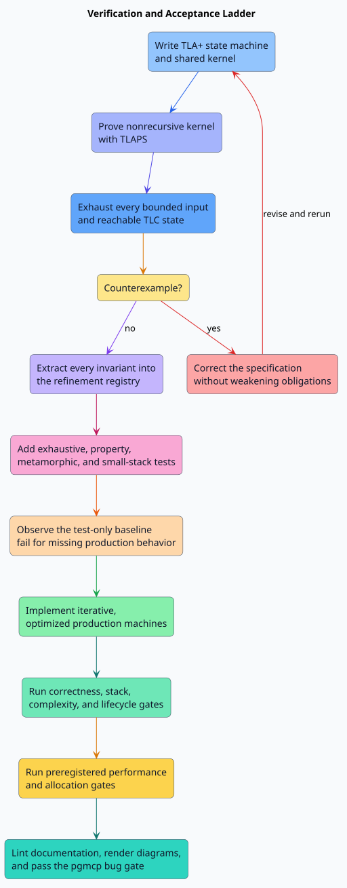

# Scientific evidence method

## Claims and limits

TLC performs exhaustive state exploration within each declared finite model.
The evidence therefore establishes every configured invariant and temporal
property for every enumerated input and reachable interleaving. It does not, by
itself, prove those predicates for arbitrary task counts. TLAPS supplies an
unbounded theorem for the shared symmetric effect kernel. Property tests,
independent exhaustive Rust oracles, and refinement review extend the evidence
to production code.

[PlantUML source for the verification ladder](../design/figures/verification-ladder.puml)

## Factorized exhaustive families

Naively crossing all graph, effect, cost, outcome, cancellation, and execution
dimensions would repeat unrelated state-machine structure. The model instead
factorizes the input space while checking the complete invariant set in every
family.

| Family | Enumeration | Completeness argument |
| --- | --- | --- |
| Empty | one input and two reachable states | The zero-task domain has one dependency/effect/cost/outcome interpretation |
| Dependencies | $`2^{3(3-1)}=64`$ relations | Every directed non-self edge is independently absent or present |
| Effects | $`(2^2)^{2+2}=256`$ maps | Two tasks are the full arity of the pairwise predicate; two resources cover all set-overlap classes |
| Resources | $`3^3=27`$ cost maps | Each of three tasks independently takes cost one, two, or the first over-budget value three |
| Outcomes | $`3^3\cdot4=108`$ inputs | Every success/failure/incomplete map is crossed with every committed-count boundary |

The effects family was deliberately reduced from three tasks to two after an
initial run showed redundant expansion. This does not sample the predicate:
`Independent` consumes exactly two tasks. Full-batch use remains checked by the
same `PlanIsCanonicalAndLawful` invariant.

## Counterexample discipline

Any TLC trace is treated as a specification defect until explained. The first
dependency run found that a successful terminal commit cursor advances one
position beyond the final task while `TypeOK` allowed only task positions. The
type invariant was corrected to include that sentinel. No behavioral predicate
was removed or weakened.

An incomplete checker process is never counted as a pass. The wrapper requires
the explicit no-error verdict, complete-state-graph depth, and zero states left
on the queue.

## Independence of evidence

The production test sequence intentionally uses several mechanisms:

1. bounded exhaustive reference oracles enumerate all small graphs and
   scheduler traces;
2. property tests generate larger shapes and metamorphic transformations;
3. small-stack subprocesses test native-stack bounds and destruction;
4. operation counters test asymptotic work independently of wall-clock noise;
5. preregistered benchmarks test throughput, latency, allocation, and scaling;
6. the TLA+ state machine remains the semantic source of truth.

Agreement among distinct mechanisms is stronger evidence than duplicating one
implementation in its tests.

## Reproducibility

Every check records its output under persistent `target/`. TLC uses one worker
for deterministic resource containment, a 1 GiB Java heap inside a 4 GiB
no-swap systemd scope, and headless mode. Scenario configurations, tool output,
state counts, and graph depths are reviewable before generated evidence is
cleaned.
