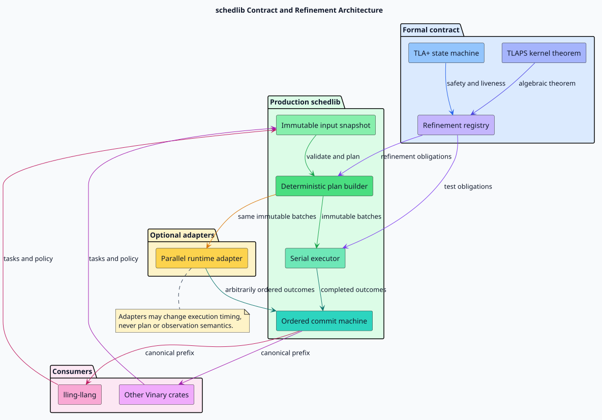

# Deterministic scheduling theory

## Problem statement

Let $`\mathcal{T}`$ be a finite task set, $`D`$ a dependency relation,
$`R(t)`$ and $`W(t)`$ the read and write effects of task $`t`$,
$`c(t)`$ its positive cost, and $`B`$ the batch budget. schedlib must
construct one deterministic plan, permit independent work to execute
concurrently, and expose exactly the observation produced by canonical serial
execution.

This separation matters. Deterministic execution order would suppress useful
parallelism. Unordered publication would make callers observe timing accidents.
An immutable plan plus ordered commit permits arbitrary completion without
observable nondeterminism.



[PlantUML source for the contract architecture](../design/figures/contract-architecture.puml)

## Acceptance domain

The dependency relation is accepted precisely when it is acyclic. Resource
configuration is accepted precisely when each individual cost fits the budget:

```math
\mathrm{admissible}(c,B)
  \iff \forall t\in\mathcal{T}:\; c(t)\leq B.
```

The planner performs both checks before publishing a plan or invoking a worker.
This makes rejection atomic.

## Effect independence

Tasks $`u`$ and $`v`$ may share a batch exactly when both directed hazards
are absent:

```math
\mathrm{independent}(u,v)
\iff
\begin{aligned}
W(u)\cap(R(v)\cup W(v)) &= \varnothing,\\
W(v)\cap(R(u)\cup W(u)) &= \varnothing.
\end{aligned}
```

The two clauses make the relation symmetric. TLAPS proves this propositional
kernel for arbitrary sets; TLC checks its use in every reachable bounded batch.
Read/read overlap remains safe because neither task publishes a write.

## Canonical topological order

The order is Kahn's topological process with a minimum stable-identifier ready
set. The following literate pseudocode states both the operation and its
invariant.

> **Canonical topology.** Maintain an indegree for every task and a min-priority
> queue containing exactly the un-emitted zero-indegree tasks. Removing the
> minimum makes each choice unique. Decrementing each outgoing neighbor once
> accounts for every edge exactly once.

```text
CANONICAL-TOPOLOGY(tasks, outgoing, indegree)
    ready := MIN-QUEUE(task IN tasks WHERE indegree[task] = 0)
    order := EMPTY-SEQUENCE-WITH-CAPACITY(|tasks|)

    WHILE ready IS NOT EMPTY
        task := POP-MIN(ready)
        APPEND(order, task)
        FOR EACH neighbor IN outgoing[task]
            indegree[neighbor] := indegree[neighbor] - 1
            IF indegree[neighbor] = 0
                PUSH(ready, neighbor)

    IF |order| != |tasks|
        RETURN REJECTED-CYCLE
    RETURN order
```

The production algorithm is iterative. libvgraph provides forward and reverse
CSR, while schedlib uses a binary min-heap for the ready set. Its work is
$`O((|\mathcal{T}|+|D|)\log|\mathcal{T}|)`$. Exact vertex, edge, ready-push,
and ready-pop counts are exposed through `PlanWorkProfile`.

## Deterministic first-fit batches

Tasks are considered in canonical topological order. The dependency floor for
task $`t`$ is the latest batch containing a predecessor. Beginning strictly
after that floor, the planner selects the first batch satisfying both:

```math
\begin{aligned}
\forall u\in P_i &: \mathrm{independent}(u,t),\\
\sum_{u\in P_i}c(u)+c(t) &\leq B.
\end{aligned}
```

If none accepts the task, the planner appends a singleton batch. Otherwise it
inserts the task into the selected batch in stable-identifier order. Sorted
insertion is necessary because minimum-ready Kahn order is canonical but not
globally increasing: a low identifier can become ready only after a higher
predecessor has been emitted. Batch assignment still follows first fit; only
the independent members' internal publication order is canonicalized.

For example, the verified `BatchOrder` scenario uses dependency $`4\to1`$ and
conflict pairs $`\{1,4\}`$ and $`\{2,3\}`$. Kahn order is
$`\langle2,3,4,1\rangle`$. Append-only placement would incorrectly produce
the decreasing batch $`\langle3,1\rangle`$; sorted insertion produces the
unique plan $`\langle\langle2,4\rangle,\langle1,3\rangle\rangle`$.

The stable consideration order, first-fit rule, and sorted insertion make the
entire plan canonical. This is a deterministic policy, not a claim of globally
minimum makespan; classical resource-constrained scheduling is a distinct
optimization problem described by Garey and Graham in
[“Bounds for Multiprocessor Scheduling with Resource Constraints”](https://doi.org/10.1137/0204015).

## Ordered observation

Let $`F=\mathrm{flat}(P)`$. At every instant, the committed sequence
$`C`$ must be a prefix of $`F`$:

```math
\exists j\in\{0,\ldots,|F|\}:\; C=F[1..j].
```

Workers can populate an internal result set in any order. Commit waits until
the current batch is complete, then publishes one task at a time in batch
order. The first failure or structured incomplete outcome terminates after its
own publication. A cancellation request becomes effective at an exact
committed-prefix length, never halfway through one commit transition.

This serial/parallel observational equivalence is stronger than deterministic
final output: intermediate prefixes, terminal phase, first non-success
position, incomplete reason, and cancellation boundary are equal as well. The
empty task set is the identity case: validation moves directly to completed
with empty plan and observation.

## Formal basis

The state machine uses the Temporal Logic of Actions (TLA), introduced by
Lamport in [“The Temporal Logic of Actions”](https://doi.org/10.1145/177492.177726).
The language, safety/liveness distinction, weak fairness, and TLC workflow are
documented in Lamport's
[“Specifying Systems”](https://lamport.azurewebsites.net/tla/book.html).
