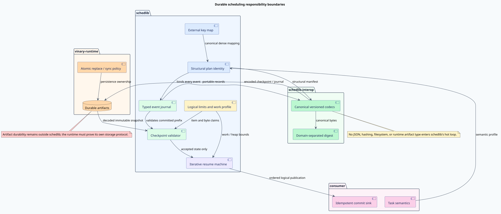
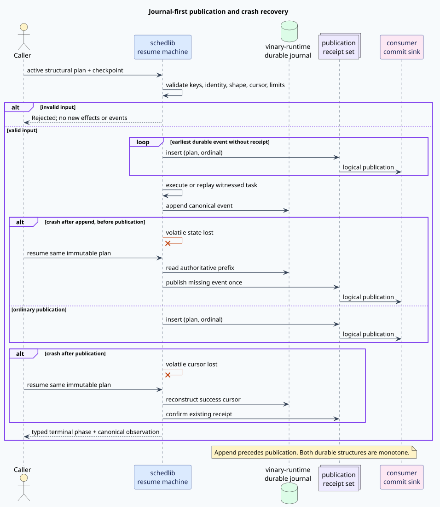

# Durable identity and committed-prefix resume

## Purpose

This document defines the mathematical contract for adding durable execution to
schedlib without weakening its deterministic scheduling semantics. The
contract answers four questions before storage code exists:

1. Which plan is being resumed?
2. Which ordered outcomes are already durable?
3. Which of those outcomes have been published logically?
4. Which work, if any, may safely execute again after a crash?

The answer is a structural plan identity, an append-only canonical journal, an
idempotent publication-receipt set, and an explicit replay witness. A digest
may index or transport a structural identity, but finite hash equality never
defines semantic equality.



[PlantUML source for the responsibility-boundary diagram](../design/figures/durable-resume-boundaries.puml)

## Vocabulary and notation

Let $`K=\langle k_0,\ldots,k_{n-1}\rangle`$ be the canonical sequence of
caller-owned stable task keys. A dense identifier is an index
$`d\in\{0,\ldots,n-1\}`$. The key map is a bijection
$`\kappa:K\leftrightarrow\{0,\ldots,n-1\}`$.

The structural plan identity is the tuple

```math
I = \langle
  v, K, D, E, C, B, S
\rangle,
```

where $`v`$ is the identity schema, $`D`$ is the canonical dependency
relation, $`E`$ is canonical effect metadata, $`C`$ is the cost vector,
$`B`$ is the batch budget, and $`S`$ is the caller-supplied semantic profile.
Two identities are equal exactly when every component is equal.

An event has an identifier

```math
\mathrm{id}(e)=\langle I,o(e)\rangle,
```

where $`o(e)\in\mathbb{N}_{>0}`$ is its one-based ordinal. Task indices remain
zero based; an event for dense task $`d`$ has ordinal $`d+1`$. Keeping these
domains explicit prevents the common off-by-one error in which a task index is
mistaken for a portable event identifier.

## Canonical journal language

The journal alphabet contains task outcomes `Success`, `Failure`, and
`Incomplete`, plus boundary outcomes `Cancelled`, `ResourceLimited`, and
`Completed`. A valid journal is one of:

- a prefix of successful task events;
- a successful prefix followed by one task failure;
- a successful prefix followed by one incomplete task;
- a successful prefix followed by one cancellation event;
- a successful prefix followed by one resource-limit event; or
- all task successes followed by one completed event.

If $`J=\langle e_1,\ldots,e_m\rangle`$ is valid, then
$`o(e_i)=i`$ for every $`i\in\{1,\ldots,m\}`$. There are no duplicate event
identifiers within one plan, no event follows a terminal event, and
$`|J|\leq n+1`$.

Cancellation has deterministic priority when cancellation and resource
limitation are observed at the same pre-task boundary. This is a policy choice
bound into $`S`$; it removes a nondeterministic terminal outcome without
conflating the two result types.

## Journal-first publication

The journal is authoritative. Logical publication of event $`e`$ has the
precondition $`e\in J`$. The publication ledger $`R`$ is a canonical prefix
of event identifiers from $`J`$ and insertion is idempotent:

```math
\mathrm{insert}(x,\mathrm{insert}(x,R))
  = \mathrm{insert}(x,R).
```

The durable append is therefore before the publication linearization point.
This is the same ordering principle that motivates write-ahead recovery, while
the exact schedlib protocol is intentionally much smaller than a database
transaction manager. See Mohan et al.,
[“ARIES: A Transaction Recovery Method Supporting Fine-Granularity Locking and Partial Rollbacks Using Write-Ahead Logging”](https://doi.org/10.1145/128765.128770).

Publication is a logical exactly-once observation, not a claim that physical
delivery occurs only once. A consumer can receive a retry after loss of
volatile state. The pair $`\langle I,o\rangle`$ lets the consumer collapse that
retry without collapsing equal ordinals from different plans. This distinction
is consistent with the operation-centric correctness discipline introduced by
Herlihy and Wing in
[“Linearizability: A Correctness Condition for Concurrent Objects”](https://doi.org/10.1145/78969.78972).

## Checkpoint validity

A checkpoint contains the structural plan identity, canonical journal,
publication prefix, zero-based next-task cursor, integrity result, declared
event count, and bounded encoded-byte usage. It is accepted only if all fields
agree.

Let $`s(J)`$ be the length of the leading success sequence. The cursor law is

```math
\mathrm{cursor}=s(J).
```

A terminal event is not a successful task and therefore does not advance the
cursor. The encoded event count still equals $`|J|`$. This distinction permits
a terminal checkpoint to be inspected safely without suggesting that a failed
task committed successfully.

## Crash and recovery cases



[PlantUML source for the crash-recovery sequence](../design/figures/durable-crash-recovery-sequence.puml)

There are three semantically distinct crash points.

### Before journal append

No event is durable. Re-execution is admissible only if the task carries one
of these immutable witnesses:

- deterministic: repeating the task under the same input produces the same
  effect and result;
- idempotent: repeating the effect is observationally equal to performing it
  once; or
- transactional: the external system provides an atomic retry or deduplication
  boundary.

An unsafe in-flight task fails closed. The scheduler does not infer safety from
the task's Rust type, name, or historical behavior.

### After append, before publication

The event is authoritative but lacks a receipt. Recovery publishes the earliest
missing journal identifier without rerunning the task.

### After publication

Both journal event and receipt survive. Recovery reconstructs the task cursor
from the successful journal prefix and advances without duplicate logical
publication.

## Resume equivalence

Let $`J_p`$ be a valid prefix of uninterrupted journal $`J`$. Resume obtains
the unique suffix $`J_s`$ such that

```math
J = J_p \mathbin{+\!+} J_s.
```

The resumed journal and logical observation must equal the uninterrupted
serial result. If a parallel executor physically completes a batch in order
$`Q`$, canonical normalization filters the immutable plan order $`F`$ by
membership in $`Q`$. For a complete permutation, normalization returns $`F`$.
Physical completion order is therefore absent from durable identity, journal
order, and public observation.

## Liveness and resource laws

Every validated finite run terminates under weak fairness. Replay uses an
explicit heap cursor. If journal length is $`m`$ and cursor is $`c<m`$, the
remaining measure is

```math
\mu(m,c)=m-c,
```

and one replay step establishes $`\mu(m,c+1)<\mu(m,c)`$. Validation,
publication, and replay have linear bounded work and linear heap state. Native
call-stack depth is constant with respect to keys, tasks, events, and encoded
bytes. Recursive definitions in the proof artifacts are denotational only;
production refinement must use iterative cursors, arenas, or a specialized
pushdown automaton when semantics are genuinely pushdown shaped.
